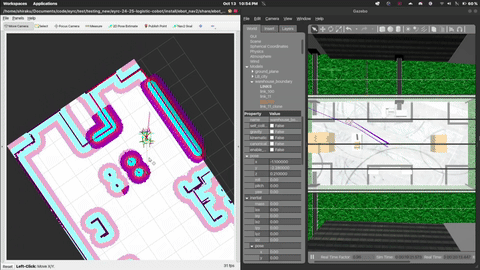

# eYRC-2024 Integrated Logistic System  
**Mobile Robot Navigation & UR5 Robotic Arm Pick-and-Place**

This repository demonstrates an integrated solution for logistics automation where a mobile robot navigates autonomously within a defined environment and docks with a UR5 robotic arm for pick-up and drop-off operations. The system is designed using the latest **ROS2 Humble** ecosystem on **Ubuntu 22.04 LTS**, combining real-time mapping and navigation (using **Nav2** and **slam_toolbox**) with high-precision manipulation (using **MoveIt2** on the UR5 arm).

---
### Pick and Place


### UR5 Arm Manipulation


### SLAM using EKF and AMCL


---

## Table of Contents

- [Project Overview](#project-overview)
- [Technologies Used](#technologies-used)
- [Task Description](#task-description)
- [System Architecture](#system-architecture)
- [How It Works](#how-it-works)
- [Features and Highlights](#features-and-highlights)
- [Robot Navigation & Arm Control Details](#robot-navigation--arm-control-details)
- [Getting Started](#getting-started)
  - [Prerequisites](#prerequisites)
  - [Installation Guide](#installation-guide)
- [How to Run](#how-to-run)
- [Task Completion & Evaluation](#task-completion--evaluation)
- [Acknowledgments](#acknowledgments)
- [License](#license)

---

## Project Overview

The **eYRC-2024 Integrated Logistic System** is built to address dynamic logistic tasks, where a mobile robot autonomously traverses a mapped environment to reach a docking station. At the station, a UR5 robotic arm performs pick-and-place operations to load or unload objects. Once the operation is completed, the mobile robot resumes its navigation to a designated drop-off zone, docks again if needed, and then returns to the starting position to repeat the process.

Key aspects of the system include:

- **Autonomous Mobile Navigation:** Using the ROS2 **Nav2 stack** and **slam_toolbox** for real-time 2D mapping and localization.
- **Robotic Arm Manipulation:** Utilizing **MoveIt2** for motion planning and execution of pick-and-place tasks by the UR5 arm.
- **Seamless Integration:** Coordinated operations between the mobile robot and the UR5 arm via ROS2, ensuring reliable docking, object handling, and drop-off.
- **Updated Platform:** All software components are upgraded to run on **ROS2 Humble** and **Ubuntu 22.04 LTS**.

Here are some videos:
https://www.youtube.com/watch?v=goGjxwGQOxA
https://www.youtube.com/watch?v=2TzqV2MuxkU
https://www.youtube.com/watch?v=pqedHbMaoMQ

---

## Technologies Used

- **ROS2 Humble** on **Ubuntu 22.04 LTS**
- **Nav2 Stack**: Autonomous navigation, path planning, and obstacle avoidance for the mobile robot.
- **slam_toolbox**: Real-time mapping and localization.
- **MoveIt2**: Motion planning and execution for the UR5 robotic arm.
- **UR5 Robotic Arm**: For precise pick-and-place operations.
- **ArUco Marker Detection**: For object localization and coordinate transformation.
- **Python**: Scripting and integration between ROS2 nodes.
- **Gazebo**: Simulation environment for testing the integrated system.

---

## Task Description

The integrated logistic task involves the following sequence:

1. **Autonomous Navigation:**  
   - The mobile robot generates a real-time 2D map and autonomously navigates to a predefined docking station using **slam_toolbox** and **Nav2**.
   - The target poses must be reached within a positional tolerance of **±0.3 m** and an orientation tolerance of **±10°**.

2. **Docking and Interaction with UR5 Arm:**  
   - At the docking station, the mobile robot aligns with the UR5 arm station.
   - The UR5 robotic arm, using **MoveIt2** and precise TF transformations, executes a pick-up or drop-off operation via its magnet-based or gripper mechanism.
   
3. **Payload Transport & Cycle Repeat:**  
   - Once the UR5 arm completes the pick-and-place task, the mobile robot is directed to transport the payload to the drop zone.
   - The cycle concludes with the mobile robot docking, dropping off the payload, and returning to the arm station for the next operation.

---

## System Architecture

The overall system architecture comprises three primary subsystems:

1. **Mobile Robot Subsystem:**  
   - Equipped with LIDAR, IMU, and other sensors.
   - Uses **Nav2** and **slam_toolbox** for real-time SLAM and precise navigation.

2. **UR5 Robotic Arm Subsystem:**  
   - Utilizes **MoveIt2** for motion planning and grasp execution.
   - Employs ArUco markers and TF for accurate object localization and arm alignment.

3. **Integration and Communication Layer:**  
   - ROS2 nodes interconnect both subsystems via topics and services.
   - A central coordination node schedules navigation goals and arm commands based on task status and sensor feedback.

---

## How It Works

### Workflow:

1. **Mapping & Navigation:**
   - The mobile robot initiates a SLAM procedure with **slam_toolbox** to build and update a 2D map.
   - **Nav2** computes and follows paths to the docking station, ensuring adherence to defined tolerances.

2. **Docking Procedure:**
   - The mobile robot docks at the UR5 arm station where precise positioning cues are provided (using ArUco markers).
   - A dedicated coordination node confirms alignment before initiating arm operations.

3. **Pick-and-Place Operations:**
   - The UR5 robotic arm, through **MoveIt2**, moves to the predefined joint positions for picking up or releasing an object.
   - Gripper control services (e.g., `/GripperMagnetON` and `/GripperMagnetOFF`) are used to securely hold or release the payload.

4. **Transport & Drop-Off:**
   - Post interaction, the mobile robot navigates to the drop-off zone.
   - It docks and unloads the payload (possibly via another UR5 arm station if bidirectional operations are needed), then returns for the next operation.

---

## Features and Highlights

- **Integrated Robotic Operations:** Combines autonomous mobile navigation with precision arm manipulation.
- **ROS2 Humble & Ubuntu 22.04 LTS Compatibility:** Ensures long-term support and modern development workflows.
- **Robust SLAM and Navigation:** Real-time mapping using **slam_toolbox** integrated with **Nav2** for precise pose control.
- **High-Precision Manipulation:** Use of **MoveIt2** guarantees accurate pick-and-place operations with the UR5 arm.
- **Seamless Inter-System Communication:** ROS2 messaging facilitates smooth coordination between the mobile robot and UR5 arm.
- **Extensible Architecture:** Modular design that supports additional sensors, advanced object detection, or more complex task scheduling.

---

## Robot Navigation & Arm Control Details

### Mobile Robot Navigation

- **Global & Local Planners:**  
  The mobile robot’s navigation uses a global planner to compute obstacle-free paths and a local planner for dynamic adjustments during movement.

- **Sensor Integration:**  
  Onboard LIDAR and IMU data combined with real-time SLAM ensures robust localization and mapping.

### UR5 Robotic Arm Control

- **Motion Planning with MoveIt2:**  
  The arm executes pick-and-place operations following pre-programmed joint configurations (e.g., approach, pick-up, drop-off).

- **ArUco Marker Localization:**  
  Vision-based detection provides additional accuracy during docking and object alignment.

- **Gripper Services:**  
  Service calls such as `/GripperMagnetON` and `/GripperMagnetOFF` control the gripper state during the manipulation cycle.

---

## Getting Started

### Prerequisites

- **Operating System:** Ubuntu 22.04 LTS
- **ROS2:** Humble Hawksbill
- **Gazebo:** For simulation of mobile and arm operations
- **Dependencies:**
  - ROS2 Nav2 and slam_toolbox packages
  - ROS2 MoveIt2 packages and UR5 configuration packages
  - Python 3 (3.8+ recommended)

### Installation Guide

1. **Install ROS2 Humble:**  
   Follow the [ROS2 Humble installation guide](https://docs.ros.org/en/humble/Installation.html).

2. **Install Required Packages:**
   ```bash
   sudo apt install ros-humble-nav2-bringup ros-humble-slam-toolbox ros-humble-moveit ros-humble-<other-required-packages>
   ```

3. **Clone the Repository:**
   ```bash
   git clone https://github.com/your-username/eyrc-2024-integrated-logistics.git
   cd eyrc-2024-integrated-logistics
   ```

4. **Install Dependencies via rosdep:**
   ```bash
   rosdep install --from-paths src --ignore-src -r -y
   ```

5. **Build the Workspace:**
   ```bash
   colcon build --symlink-install
   ```

6. **Source the Workspace:**
   ```bash
   source install/setup.bash
   ```

---

## How to Run

1. **Launch the Integrated System:**
   - To launch the complete system (mobile robot navigation, UR5 arm control, and coordination):
   ```bash
   ros2 launch integrated_system launch_integrated_system.py
   ```

2. **Monitoring and Debugging:**
   - Use ROS2 tools (e.g., `rviz2` for visualization and `ros2 topic echo` for debugging) to monitor system status.

---

## Task Completion & Evaluation

Upon successful run, the following artifacts will be generated:
- **Log Files:** Detailed logs of navigation and arm operations.
- **Map Data:** SLAM-generated map (e.g., `map.pgm` and accompanying YAML files).
- **Bag Files:** Recorded ROS2 bag files for analysis (`my_bag_0.db3`).
- **Video Demonstrations:** Recordings of the complete operation cycle.

These files and logs serve as the basis for performance evaluation according to the eYRC-2024 guidelines.

---


## Acknowledgments

- **eYRC Team:** For providing the competition framework and evaluation criteria.
- **ROS2 and MoveIt2 Communities:** For their continued support and development of robust robotics frameworks.
- **Contributors and Collaborators:** Whose efforts made this integrated system possible.

---

## License

This project is licensed under the [MIT License](LICENSE).
